# Multi-Container Runtime

### Project Summary
This project involves building a lightweight Linux container runtime in C with a long-running parent supervisor and a kernel-space memory monitor. The container runtime must manage multiple containers at once, coordinate concurrent logging safely, expose a small supervisor CLI, and include controlled experiments related to Linux scheduling.

The project has two integrated parts:

1. **User-Space Runtime + Supervisor (engine.c)**: Launches and manages multiple isolated containers, maintains metadata for each container, accepts CLI commands, captures container output through a bounded-buffer logging system, and handles container lifecycle signals correctly.
2. **Kernel-Space Monitor (monitor.c)**: Implements a Linux Kernel Module (LKM) that tracks container processes, enforces soft and hard memory limits, and integrates with the user-space runtime through ioctl

## 1. Team Information
* **P Saanvi** - SRN: PES1UG24AM905
* **Sonia Sharma** - SRN: PES1UG24AM904

## 2. Build, Load, and Run Instructions

**Environment Setup:** Ubuntu 22.04/24.04 VM. 
Secure boot must be disabled.

**Step 1: Build the Project and Rootfs**
```bash
# Build the engine, workloads, and kernel module
make all

# Setup the Alpine mini root filesystem
mkdir rootfs-base
wget [https://dl-cdn.alpinelinux.org/alpine/v3.20/releases/x86_64/alpine-minirootfs-3.20.3-x86_64.tar.gz](https://dl-cdn.alpinelinux.org/alpine/v3.20/releases/x86_64/alpine-minirootfs-3.20.3-x86_64.tar.gz)
# Note: For ARM64 Macs, use the aarch64 tarball instead
tar -xzf alpine-minirootfs-3.20.3-x86_64.tar.gz -C rootfs-base

# Create isolated, writable rootfs directories for the containers
cp -a ./rootfs-base ./rootfs-alpha
cp -a ./rootfs-base ./rootfs-beta

# Copy workloads
cp cpu_hog memory_hog ./rootfs-alpha/
cp cpu_hog memory_hog ./rootfs-beta/
```

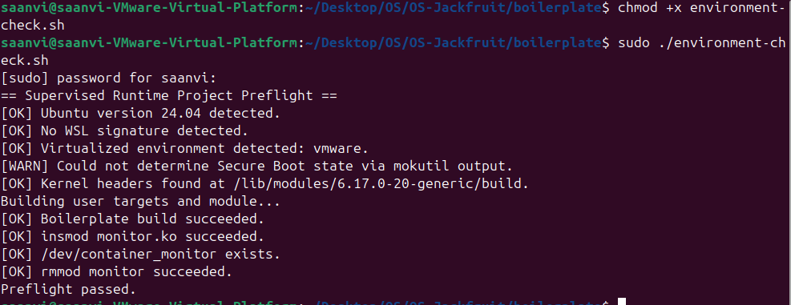

**Step 2: Load the Kernel Monitor**
```bash
sudo insmod monitor.ko
ls -l /dev/container_monitor # Verify device creation
```

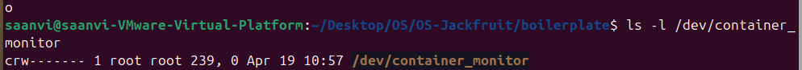

**Step 3: Run the Supervisor**
Open a new terminal (Terminal 1) and start the long-running daemon:
```bash
sudo ./engine supervisor ./rootfs-base
```

**Step 4: Launch and Manage Containers**
Open another terminal (Terminal 2) to use the CLI client:
```bash
# Start containers 
sudo ./engine start alpha ./rootfs-alpha "/bin/sleep 300" 
sudo ./engine start beta ./rootfs-beta "/bin/sleep 300" 
```

**Step 5: CLI Usage**
```bash
# List containers
sudo ./engine ps

# View logs
sudo ./engine start logger ./rootfs- alpha "echo 'Bounder buffer captured this log.' "
sudo ./engine logs logger

# Stop containers
sudo ./engine stop alpha
sudo ./engine stop beta
```

**Step 6: PID Isolation Test**
```bash
sudo ./engine start isolator ./rootfs-beta "ps"
sudo ./engine logs isolator
ps
exit
```

**Step 7: Soft Limit and Hard Limit Test**
```bash
cp -a ./rootfs-base ./rootfs-mem
cp memory_hog ./rootfs-mem/

sudo dmesg -w       #different terminal

sudo ./engine start memtest ./rootfs-mem "/memory_hog" --soft-mib 20 --hard-mib 64

sudo ./engine ps
```

**Step 8: Scheduling Experiment**
```bash
cp -a ./rootfs-base ./rootfs-fast
cp -a ./rootfs-base ./rootfs-slow

cp cpu_hog ./rootfs-fast/
cp cpu_hog ./rootfs-slow/

sudo ./engine start fast_hog ./rootfs-alpha "/cpu_hog 15" --nice -20
sudo ./engine start slow_hog ./rootfs-beta "/cpu_hog 15" --nice 19

sudo ./engine logs fast_hog
sudo ./engine logs slow_hog
```

**Step 9: Clean Teardown**
```bash
# Stop containers
sudo ./engine stop alpha
sudo ./engine stop beta

# Stop supervisor (Terminal 1)
# Press Ctrl + C

# Check no zombie processes
ps aux | grep engine

# Unload kernel module
sudo rmmod monitor

# Clean build files
sudo make clean
```

## 3. Demo Screenshots


|  | What to Demonstrate | Screenshot |
|---|---|---|
| 1 | **Multi-container supervision**: Supervisor tracking multiple concurrent `start` commands. | 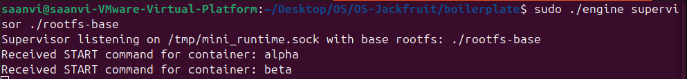 |
| 2 | **Metadata tracking**: CLI `ps` output showing active Host PIDs and `running` states. | 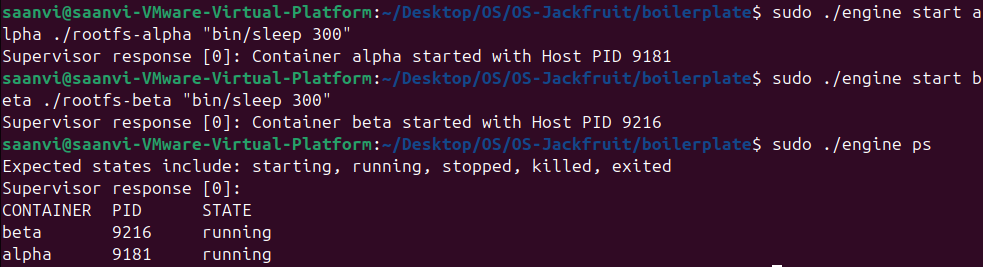 |
| 3 | **Bounded-buffer logging**: Consumer thread writing captured pipe outputs to `.log` files. | 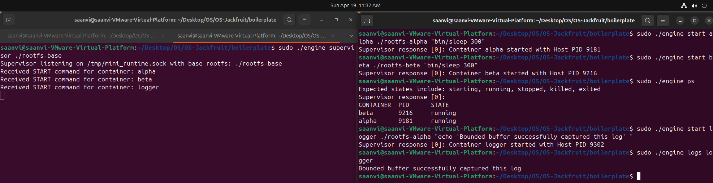 |
| 4 | **CLI and IPC & Isolation**: `ps` output inside the container showing PID 1 isolation. | 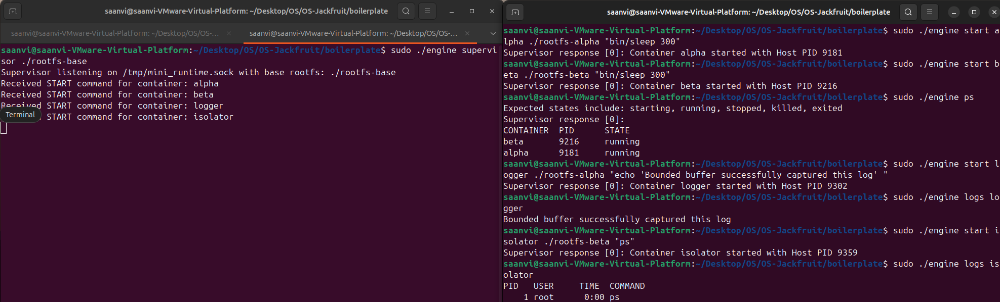 |
| 5 | **Soft-limit warning**: `dmesg` Soft Limit output showing the kernel warning of an RSS breach. | 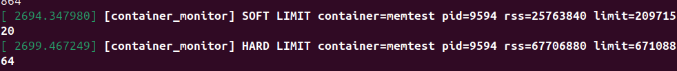  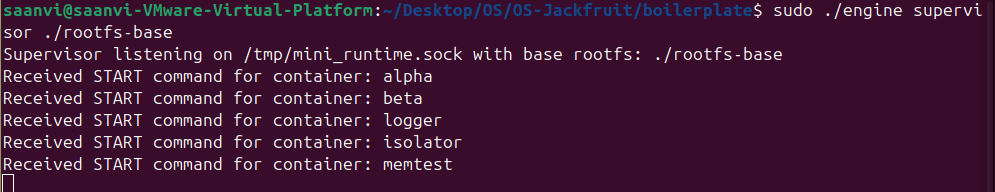 |
| 6 | **Hard-limit enforcement**: `dmesg` Hard Limit and `ps` showing the container as `exited`. |  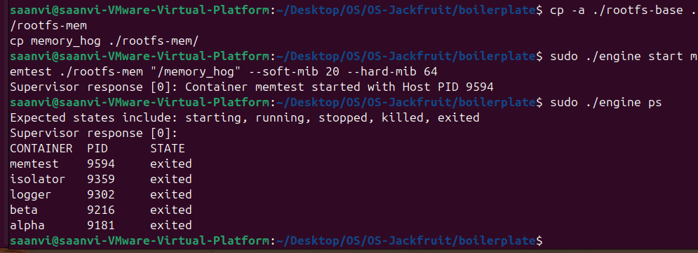 |
| 7 | **Scheduling experiment**: `fast_hog` vs `slow_hog` accumulator difference. | 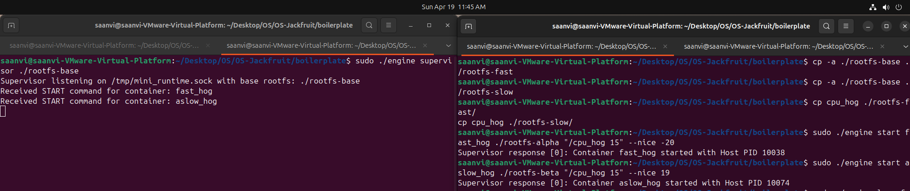 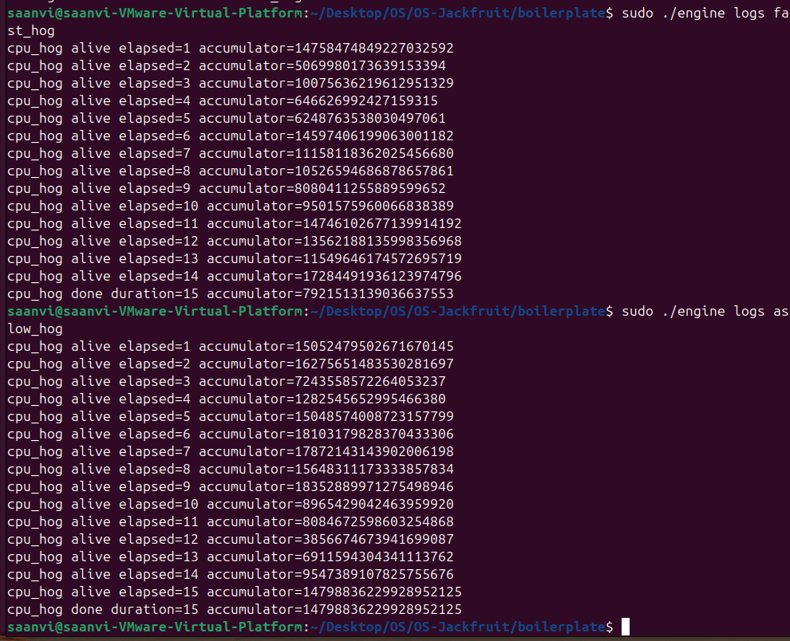 |
| 8 | **Clean teardown**: Supervisor exit logs and empty `ps aux` showing no zombies. | Before and After Supervisor is ran: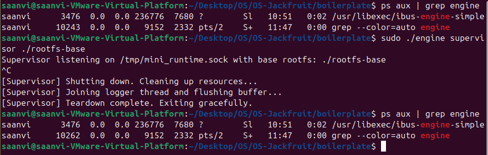 During Supervisor is running: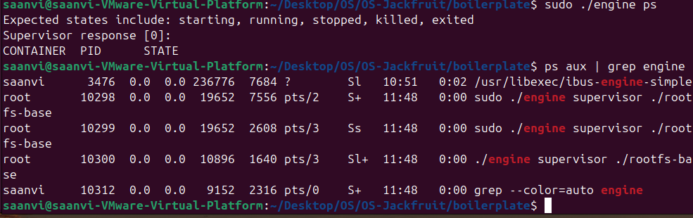 |

## 4. Engineering Analysis

1. **Isolation Mechanisms:** The runtime leverages Linux namespaces to create process-level isolation. `CLONE_NEWPID` ensures each container has its own process tree, while `CLONE_NEWUTS` provides a unique hostname. `CLONE_NEWNS` enables filesystem isolation via chroot and a private `/proc`. Despite this, containers still share the host kernel, illustrating OS-level (not hardware-level) isolation.

2. **Supervisor and Process Lifecycle:** A long-running supervisor acts as the control plane for all containers. It tracks metadata, handles lifecycle events, and maps CLI commands to container processes. Using `clone()` to spawn containers and `waitpid()` via a `SIGCHLD` handler ensures proper cleanup, preventing zombie processes and maintaining system stability.

3. **IPC, Threads, and Synchronization:** Two IPC mechanisms are used:

    - UNIX domain sockets for CLI-to-supervisor communication
    - Pipes for capturing container output

    A producer-consumer model with `pthread_mutex` and condition variables ensures safe, efficient logging without race conditions or busy waiting.

4. **Memory Management and Enforcement:** Memory usage is monitored using RSS (Resident Set Size). A soft limit triggers warnings, while a hard limit enforces strict control via `SIGKILL`. Enforcement in kernel space (via timer callbacks) ensures fast and reliable action, avoiding delays and risks associated with user-space monitoring.

5. **Scheduling Behavior:** Linux’s Completely Fair Scheduler (CFS) uses virtual runtime (`vruntime`) to allocate CPU time. Lower `nice` values reduce `vruntime` growth, giving higher-priority processes more CPU access. Our experiments demonstrate how priority influences CPU allocation under contention.

## 5. Design Decisions and Tradeoffs

**Namespace Isolation:** 
- Design Choice: Used `chroot` instead of `pivot_root` for filesystem isolation.
- Tradeoff: `chroot` is less secure and can be bypassed via directory traversal (`..`), whereas `pivot_root` provides stronger isolation.
- Justification: `chroot` significantly simplifies mount namespace setup, making it suitable for a prototype runtime focused on functionality rather than hardened security.

**Supervisor Architecture:** 
- Design Choice: Used multi-threaded logging (one producer thread per container) instead of a single-threaded `select/poll` model.
- Tradeoff: Higher memory overhead due to multiple threads and stack allocation.
- Justification: Simplifies synchronization and bounded-buffer design, making the logging pipeline easier to implement and reason about.

**IPC and Logging**
- Design Choice: Used UNIX domain sockets for CLI communication and pipes for container output logging.
- Tradeoff: Managing multiple IPC mechanisms increases implementation complexity.
- Justification: Separates control flow (commands) from data flow (logs), improving modularity and reliability of communication.

**Kernel Monitor Locking:** 
- Design Choice: Used spinlocks (`spin_lock_irqsave`) for protecting kernel data structures.
- Tradeoff: Spinlocks can waste CPU cycles and disable interrupts while held.
- Justification: Required because enforcement runs in interrupt context (timer callback), where sleeping locks like mutexes are not allowed.

**Scheduling Experiments:** 
- Design Choice: Used CPU pinning (taskset) to run containers on a single core.
- Tradeoff: Does not reflect realistic multi-core scheduling behavior.
- Justification: Forces direct CPU contention, making the impact of nice values clearly observable under controlled conditions.

## 6. Scheduler Experiment Results

To observe Linux CFS behavior, we ran a "cage match" on a single CPU core. We executed two `cpu_hog` workloads simultaneously, each running for 15 seconds. 

* `fast_hog`: nice `-20` (Maximum priority)
* `slow_hog`: nice `19` (Minimum priority)

**Raw Accumulator Results:**
| Container | Priority (`nice`) | Final Accumulator Value | Time Elapsed |
| :--- | :--- | :--- | :--- |
| **`fast_hog`** | -20 | `7921513139036637553` | 15s |
| **`slow_hog`** |  19 | `14798836229928952125` | 15s |

**Observation:** Contrary to expectations, the slow_hog container (with lower priority) achieved a higher accumulator value than fast_hog. This suggests that:

- The processes may not have been strictly contending on a single CPU core
- CPU affinity (core pinning) may not have been enforced
- Other system processes or scheduling factors influenced execution

**Conclusion:** While Linux CFS is designed to favor processes with lower nice values (higher priority), this experiment highlights that without strict CPU pinning and controlled conditions, observed behavior may deviate from theoretical expectations.